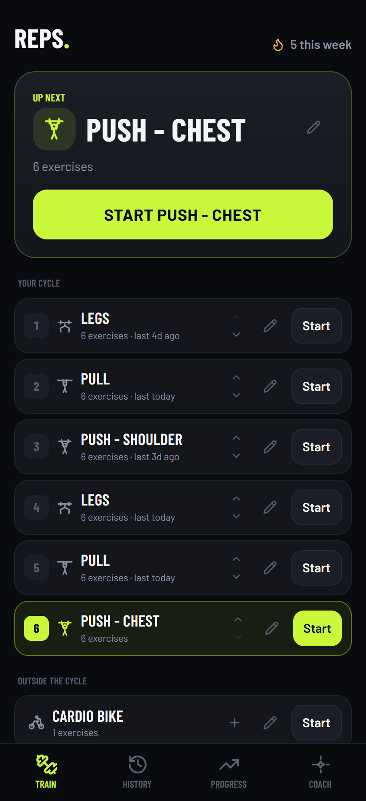
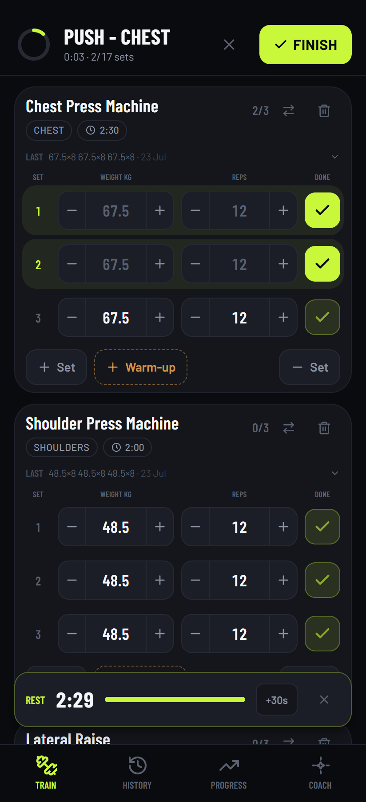
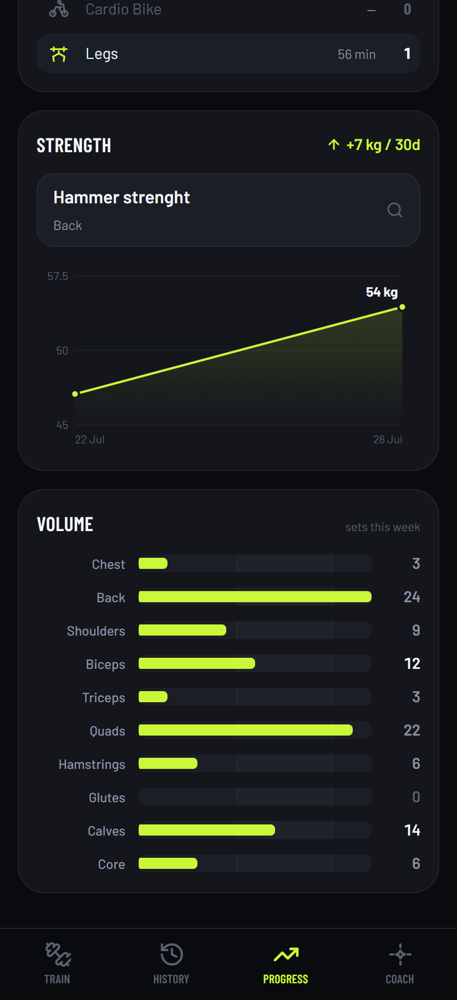
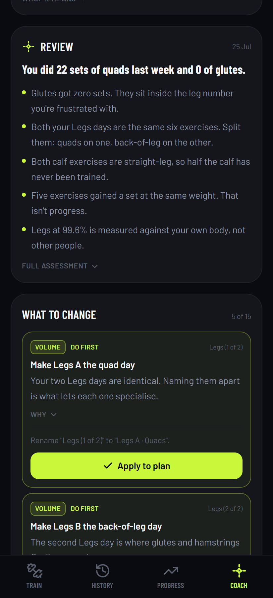
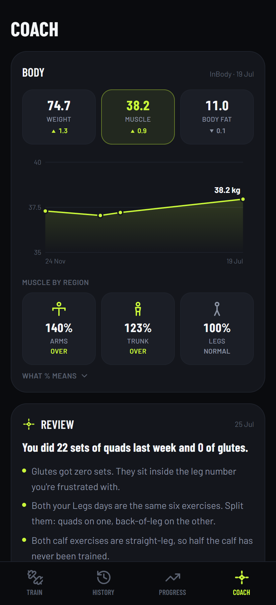

# REPS

A gym app that tells you what to train today, remembers what you lifted last time, and keeps working when your phone has no signal.

**Try it → [gym-tracker-sigma-orpin.vercel.app](https://gym-tracker-sigma-orpin.vercel.app)**

It opens in a browser. Add it to your home screen and it behaves like a normal app: full screen, own icon, no app store.
Open Google Chrome and go to the website. Tap the three dots menu icon in the top right corner.Tap Add to Home Screen or Install page as app.Tap Install to confirm

<p align="center">
  
  
  
  
</p>

---

## Why it exists

I train 5 or 6 times a week without tracking my progress nor having a personal trainer. So I built an app I would actually use. 
It has simple jobs: sequence my training, track my progress, and act a coach based on my training patterns to tell me how to improve.


---

## What it does

### Tell me what's next based on what I did last time and my program

<table>
<tr>
<td width="240"></td>
<td>

My training runs as a loop: push, pull, legs, and round again. Now I just open the app and the next session is already picked, logged with my previous data so I know if I improved.

</td>
</tr>
</table>

### Logging a set takes two taps

<table>
<tr>
<td width="240"></td>
<td>

The weight and reps are already filled in with whatever you did last time on that exercise. Same as last week? Tick the box, done.

Going heavier? Tap the arrow, then tick. Then the rest timer starts with optimize resting time between set based on best practices. 

</td>
</tr>
</table>

### It tells you when to add weight

Hitting your target reps once might just be a good day. Hit them on every set, three sessions in a row at the same weight, and the app suggests going up. It picks a sensible increase: small on a lateral raise, bigger on a leg press.

You can ignore it. It just stops you sitting at the same weight for 2 months without noticing.

### It tracks your progress

<table>
<tr>
<td width="240"></td>
<td>

Two questions to answer:

**Is this lift going up?** A line per exercise, tracking your best set over time.

**Am I training everything?** Weekly sets per muscle group, against the 10 to 20 range that research points to for growth.

It's the fastest way to notice that your back got 24 sets last week and your glutes got zero. Which is exactly what mine says, and I hadn't spotted it.

</td>
</tr>
</table>

### The plan is yours to edit

Sessions, exercises, targets, order: all editable in the app. Rename a day, add an exercise, move a session earlier in the loop.

Finish a session that didn't match the plan and the app notices, then offers to save what you actually did as the new default. It asks first. A one-off improvisation shouldn't quietly rewrite your program.

---

## The coach

This is the part most useful to me, the coaching partner.

<table>
<tr>
<td width="240"></td>
<td>

I feed my training history, my InBody body composition scans and my daily step count into Claude, along with my goals and my injuries.

It reads all of it and comes back with a written review: what's working, what I'm avoiding, and what the numbers say that I don't want to hear.

</td>
</tr>
<tr>
<td width="240"></td>
<td>

Then it turns that into a list of specific changes. Each one is a single tap to apply to the plan: add this exercise, to that day, at these sets and reps.

</td>
</tr>
</table>

It runs on my own LLM and it's wired to my setup, so it isn't switched on for everyone in the public app. If you'd want it, email me and let's talk: **jules2lebreton@gmail.com**

---

## Run it yourself

It's free and open source. If you're technical, or you know someone who is:

```bash
npm install
```

```bash
npm run dev
```

That's a fully working app on `localhost:3000`. Cloud backup needs a free [Supabase](https://supabase.com) project and two lines in a `.env.local` file, see `.env.example`.

Built with Next.js, React, TypeScript and Tailwind. Hosted on Vercel.

---

## License

MIT. Take it, fork it, change it.
